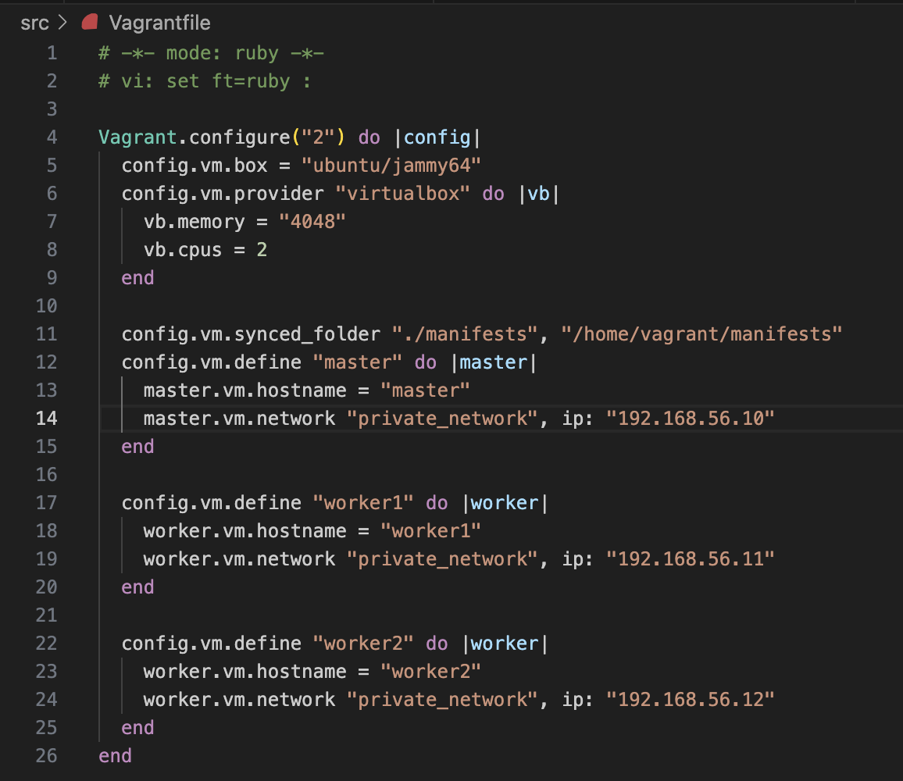
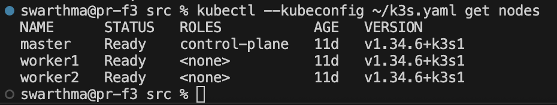
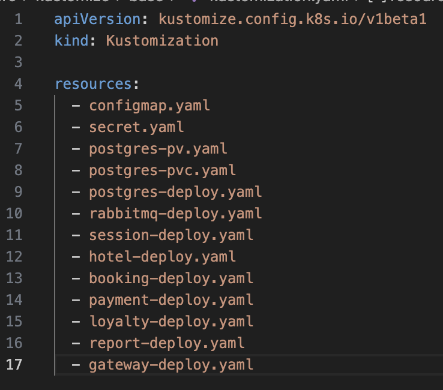
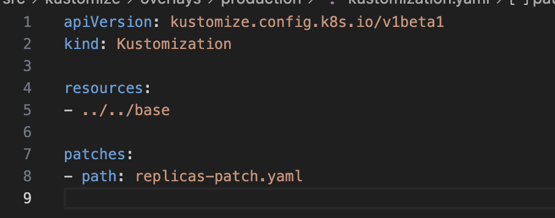
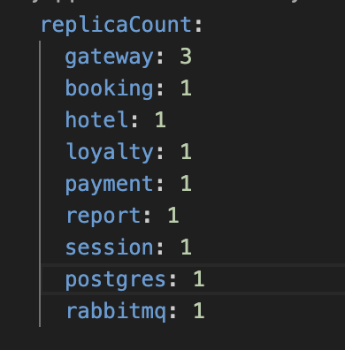
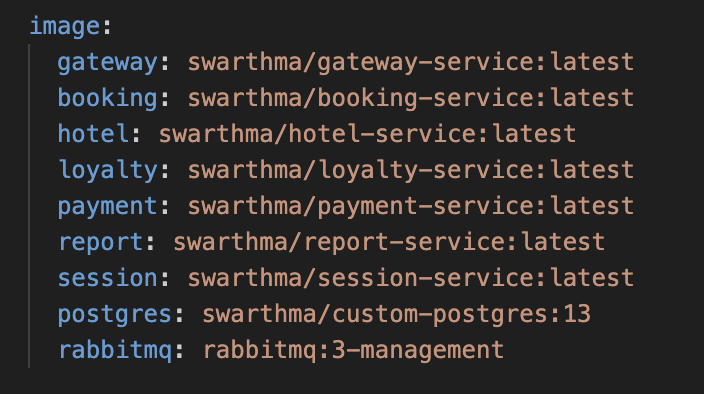
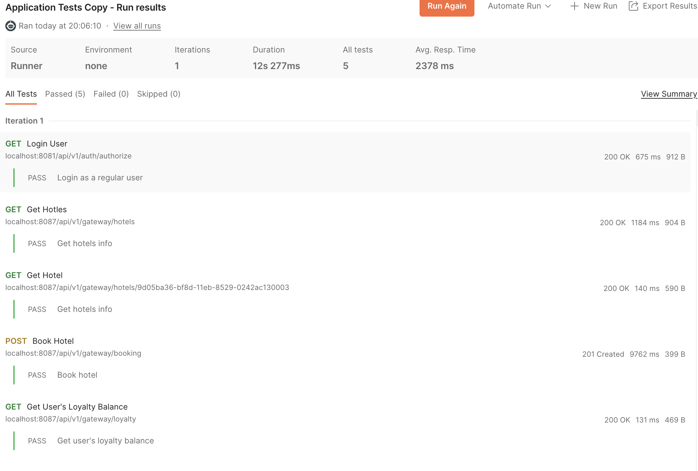

# Helm и Kustomization

## Contents

1. [Chapter I](#chapter-i) 
   2.1. [Развертывание приложения с помощью Kustomize](#part-1-развертывание-приложения-с-помощью-kustomize) \
   2.2. [Развертывание приложения с помощью Helm](#part-2-развертывание-приложения-с-помощью-helm) \

## Chapter I

Kubernetes — одна из быстро развивающихся технологий, и в настоящее время все компании внедряют ее. Когда ты запускаешь любое приложение в Kubernetes, тебе нужно развернуть очень много объектов, таких как развертывание, карта конфигурации, секреты и т. д. Тебе нужно определить все эти объекты в файле manifest.yml и отправить эти файлы на сервер API Kubernetes. Kubernetes читает эти файлы манифеста и создает нужные объекты.

Однократное развертывание приложения — это нормально, но если ты хочешь развертывать приложение снова и снова, тебе нужно снова и снова отправлять все файлы манифеста на сервер API Kubernetes. Helm — это инструмент, решающий эту проблему.

**Helm** — это менеджер пакетов для Kubernetes, который предоставляет решение для управления пакетами, безопасности и настройки при развертывании приложений в Kubernetes. Helm упрощает работу с Kubernetes.

В то же время **Kustomize** становится все более популярным инструментом для управления манифестами Kubernetes. Вместо использования шаблонов, как это делает Helm, Kustomize работает, опираясь на существующие манифесты. Используя этот шаблон, он предоставляет различные функции, включая пространство имен ресурсов, изменение метаданных и создание секретов Kubernetes — и все это без редактирования исходных манифестов.

## Part 1. Развертывание приложения с помощью Kustomize

### Задание

1. Получить набор виртуальных машин с развернутым кластером.

- Для создания виртуальных машин использовался Vagrant с конфигурацией, описанной в файле Vagrantfile. Конфигурация определяет три машины: master, worker1, worker2

- Установил k3s на всех трех машинах. При установке использовал стандартный Ingress Controller.
- Для развёртывания управляющего узла (master) использован официальный скрипт установки k3s с дополнительными параметрами, обеспечивающими корректную работу в виртуальной среде.
```
curl -sfL https://get.k3s.io | INSTALL_K3S_EXEC="server --flannel-iface=enp0s8" sh -
```
`--flannel-iface=enp0s8`  - Указывает сетевой интерфейс, который flannel (CNI плагин k3s) будет использовать для организации VXLAN туннеля. В конфигурации Vagrant приватная сеть настроена на интерфейсе enp0s8 с IP 192.168.56.x. Без этого параметра flannel использовал интерфейс по умолчанию (enp0s3, ведущий в NAT)
- Для подключения рабочих узлов к кластеру k3s устанавливается в режиме агента. На каждом узле указывается URL сервера (master), токен для аутентификации, а также явно задаются сетевые параметры для корректной работы flannel.

Установка k3s в режиме агента
```
curl -sfL https://get.k3s.io | K3S_URL=https://192.168.56.10:6443 K3S_TOKEN=K106389f79d561f15a7d7363de6e93928fe2a96b6e801aba89f8f1dc0a51d7035d9::server:46fc5aeaf29fa4440cd6dcce8eb07b56 INSTALL_K3S_EXEC="agent --flannel-iface=enp0s8" sh -

```
где:
- `K3S_URL=https://192.168.56.10:6443` - Адрес API‑сервера k3s на master. Все рабочие узлы подключаются к этому адресу.

- `K3S_TOKEN=<токен>` - Токен, полученный на master (sudo cat /var/lib/rancher/k3s/server/node-token). Используется для аутентификации агента.

-После установки на все узлы `k3s` проверяем подключение узлов:`sudo k3s kubectl get nodes`


2. Перенести манифесты из предыдущих блоков.
перенесли манифесты из проекта DO11_AdvK8s

3. Установить *kustomize* на локальной машине.
На локальном школьном Mac устанавливаем через Homebrew
- Команда `brew install kustomize`
- Вывод `kustomize version`


4. Cоздать скелет проекта развертывания с одной базовой конфигурацией (base) и одной оверлейной конфигурацией (production):

создаем структуру проекта
```
mkdir -p kustomize-project/base
mkdir -p kustomize-project/overlays/production
```
- Копируем все манифесты `*-deploy.yaml, configmap.yaml, secret.yaml, postgres-pv.yaml, postgres-pvc.yaml в base/`


```
swarthma@pr-f3 src % tree kustomize 
kustomize
├── base
│   ├── booking-deploy.yaml
│   ├── configmap.yaml
│   ├── gateway-deploy.yaml
│   ├── hotel-deploy.yaml
│   ├── kustomization.yaml
│   ├── loyalty-deploy.yaml
│   ├── payment-deploy.yaml
│   ├── postgres-deploy.yaml
│   ├── postgres-pv.yaml
│   ├── postgres-pvc.yaml
│   ├── rabbitmq-deploy.yaml
│   ├── report-deploy.yaml
│   ├── secret.yaml
│   └── session-deploy.yaml
└── overlays
    └── production
        ├── kustomization.yaml
        ├── merged.yaml
        └── replicas-patch.yaml
```


5. Написать базовые и оверлейные конфигурации для kustomize. В базовых указать сервисы и развертывания, в production добавить конкретные секреты и конфигурационные значения.

- Создаем `base/kustomization.yaml` - это файл конфигурации Kustomize, который определяет набор ресурсов, входящих в базовый слой развёртывания. В нём перечисляются все манифесты `(Deployment, Service, ConfigMap, Secret, PersistentVolume и т.д.)`, которые являются общими для любого окружения (например, для разработки, тестирования и production). `Kustomize` читает этот файл, чтобы понять, какие YAML-файлы нужно объединить в единую «базу».

Благодаря такому подходу мы можем:

Избежать дублирования – один раз описываем сервисы, их переменные окружения, монтирования томов и т.п.

Создавать оверлеи (например, overlays/production), которые будут накладывать изменения поверх базы без редактирования исходных файлов.

В нашем проекте base/kustomization.yaml включает в себя все микросервисы, базу данных PostgreSQL, брокер RabbitMQ, а также общие ConfigMap и Secret. Это позволило затем в production-оверлее просто изменить количество реплик gateway через патч, не трогая сам gateway-deploy.yaml.




- В overlays/production/kustomization.yaml определяется оверлей для окружения production — слой, который накладывает изменения на базовую конфигурацию, не редактируя оригинальные файлы в base. Это позволяет:

- Настроить production-специфичные параметры (количество реплик, переменные окружения, лимиты ресурсов и т.д.).

Применить патчи к существующим ресурсам.



6. Создать `replicas-patch.yaml` для оверлей production, который модифицирует количество реплик для деплоймента gateway service до 3 реплик.


Этот патч увеличивает количество реплик deployment gateway с 1 (значение в базе) до 3 в production-окружении.

7. Собрать результирующий конфигурационный файл, учитывая оверлей `production`. 

``` 
kustomize build . > merged.yaml
```

 выполняет сборку окончательной конфигурации Kubernetes на основе:

- Базовых ресурсов (base/),

- Патчей и дополнений из оверлея (overlays/production/).

Что происходит
Kustomize читает kustomization.yaml из текущей директории.

Загружает все ресурсы, указанные в resources (в данном случае ../../base).

Последовательно применяет все патчи из секции patches (включая replicas-patch.yaml).

Объединяет всё в один YAML-документ (ресурсы разделяются ---).

Выводит результат в стандартный поток, который мы перенаправляем в файл merged.yaml.

- `merged.yaml` - файл содержит полный набор манифестов для развёртывания приложения в production-окружении:  `ConfigMap, Secret, Service, PersistentVolume, PersistentVolumeClaim, Deployment`.

Ключевое изменение, внесённое оверлеем, — в deployment gateway количество реплик увеличено до 3.


#### Применяем конфигурацию и проверяем количество реплик
Выполняем команду `kubectl --kubeconfig ~/k3s.yaml apply -f merged.yaml`
после применения , проверяем количество реплик:
`kubectl --kubeconfig ~/k3s.yaml get pods` или `kubectl --kubeconfig ~/k3s.yaml get deployment gateway`


8. Запустить функциональные тесты Postman и удостовериться в работоспособности приложения.
чтобы успешно пройти тесты постмана нужно прокинуть порты на локальную машину 
- `kubectl --kubeconfig ~/k3s.yaml  port-forward service/session-service 8081:8081 --address 0.0.0.0` и 

- `kubectl --kubeconfig ~/k3s.yaml  port-forward service/gateway-service 8087:8087 --address 0.0.0.0`


## Part 2. Развертывание приложения с помощью Helm

### Задание 

1. Получить набор виртуальных машин с развернутым кластером.
Используем тот же кластер и удаляем старые ресурсы приложения что бы они не конфликтовали с новыми манифестами.
```
# Убедимся, что kubeconfig настроен
export KUBECONFIG=~/k3s.yaml

# Удаляем deployments
kubectl delete deployment gateway booking hotel loyalty payment report session postgres rabbitmq

# Удаляем services
kubectl delete service gateway-service booking-service hotel-service loyalty-service payment-service report-service session-service postgres rabbitmq

# Удаляем configmap и secret
kubectl delete configmap app-config
kubectl delete secret app-secret

# Удаляем PVC и PV
kubectl delete pvc postgres-pvc
kubectl delete pv postgres-pv
```
Проверяем что удалилилсь `kubectl get all,cm,secret,pvc,pv`

Кластер полностью чист – остались только системные объекты `service/kubernetes` и `configmap/kube-root-ca.crt`. Все ресурсы приложения удалены. 


3. Установить *helm* на локальной машине и удостовериться, что этот инструмент имеет валидное подключение к полученному удаленному кластеру Kubernetes.
```
brew install helm
helm version
```


4. Создать *helm*-чарты и шаблоны для своего приложения с помощью команды `helm create`. Эта команда создаст базовую структуру чарта с шаблонами для ресурсов: deployment, service и ingress.

`helm create myapp-chart` - Эта команда создаёт каталог myapp-chart/ со стандартной структурой:


`Chart.yaml` – метаданные чарта (имя, версия, описание).

`values.yaml` – файл со значениями по умолчанию.

`templates/` – каталог с шаблонами ресурсов (deployment, service, ingress, helpers и т.д.).

`charts/` – каталог для зависимостей (пуст).

`.helmignore` – файл для исключения ненужных файлов при упаковке.


 Перенести манифесты из предыдущих блоков.
Удаляем стандартные шаблоны `rm -rf templates/* charts/*` и переносим наши манифесты в `templates`


5. Отредактировать файл `values.yaml` на диаграмме, чтобы указать параметры конфигурации для твоего приложения, необходимые для создания манифестов Kubernetes для указанных развертываний (deployments). Описать объекты развертывания и сервисов в директории шаблонов (templates).
- Файл `values.yaml `– главный источник параметров чарта. Он содержит:
- Реплики сервисов

- Образы контейнеров

- Конфигурационные данные (для ConfigMap)

- Секретные данные (пароли, ключи)


 - A так же преобразовываем шаблонизируем наши манифесты.Все файлы в каталоге `templates/ ` были изменены: жёстко заданные значения заменены на выражения `{ .Values.<путь> }}.`
 -Каждое поле в `data` теперь ссылается на соответствующую переменную из `config`:

```
data:
  POSTGRES_HOST: "{{ .Values.config.POSTGRES_HOST }}"
  POSTGRES_PORT: "{{ .Values.config.POSTGRES_PORT }}" 
```


Значения секретов(`secret`) кодируются в base64 с помощью фильтра `b64enc`:

Таким образом, в values.yaml хранятся незашифрованные значения, а в кластер попадают корректные base64-строки.

- `Deployment и Service` на примере `gateway-deploy.yaml`

- Реплики: `replicas: {{ .Values.replicaCount.gateway }}`

- Образ: `image: {{ .Values.image.gateway }}`

Переменные окружения:

- Для прямых значений используется `value: {{ .Values.config.XXX | quote }}` (фильтр `quote ` гарантирует строковый тип).

- Для значений, берущихся из `secretKeyRef` или `configMapKeyRef`, изменения не требуются, так как они ссылаются на объекты `ConfigMap/Secret`, которые уже параметризованы.

Для других сервисов замены аналогичны.


6. Упаковать *helm*-чарт с помощью команды `helm package` для создания файла `*.tgz`, содержащего чарт и его зависимости.
`Helm-чарт` — это набор файлов (шаблоны, `values.yaml, Chart.yaml` и т.д.), который можно распространять. Упаковка в архив .tgz позволяет:

- Сохранить чарт в репозитории (например, в Helm-репозитории или в объектном хранилище).

- Передать чарт другим командам или системам как единый артефакт.

- Установить чарт непосредственно из архива без необходимости иметь исходные файлы.

- Управлять версионированием – имя архива включает версию чарта (берётся из Chart.yaml).
Выполнение команды `helm package`:


Что происходит:

- `Helm` читает `myapp-chart/Chart.yaml`, извлекает `name` и `version`.

 - Создаёт архив с именем `Swarthma-0.1.0.tgz`.

- Архивируются все файлы внутри `myapp-chart/`, за исключением тех, что указаны в `.helmignore`.

- Архив сохраняется в текущей директории (src/)

Проверка созданного архива `tar -tzf Swarthma-0.1.0.tgz`


7. Развернуть *helm*-чарт в кластере Kubernetes с помощью команды `helm install`. Указать произвольный `namespace` и `release-name`.


- Проверяем доступность кластера (`kubectl get nodes`)
- Создаем `kubectl create namespace swarthma` в котором будет работать приложение.


- Выполнение helm install: `swarthma@pr-f3 src % helm install swarthma-release ./swarthma-0.1.0.tgz --namespace swarthma`, где

- `swarthma-release` – имя релиза (произвольное, может быть любым).

`./swarthma-0.1.0.tgz` – путь к упакованному чарту.

`--namespace swarthma` – пространство имён, в котором будут созданы ресурсы.


8. Проверить статус развернутого приложения при помощи команды `kubectl get`. Результаты представить в отчете.

- `Helm` успешно развернул все манифесты в кластере. Проверка показала, что поды запущены, а `deployment gateway` имеет 3 реплики, как задано в `values.yaml`.

9. Внести как минимум одно изменение в `values.yaml` и выполнить команду `helm upgrade`.

- вносим изменения в файл `values.yaml`


`helm upgrade swarthma-release ./myapp-chart --namespace swarthma `

helm upgrade:

- Сравнивает текущую конфигурацию релиза с новыми манифестами (из чарта с обновлёнными значениями).

- Применяет только изменения (в данном случае – уменьшает количество реплик deployment gateway с 3 до 2, увеличивает bookinng и hotel до 2).

- Обновляет аннотации и версию релиза (Revision увеличивается на 1).


Дополнительные возможности `helm upgrade`


`helm history swarthma-release --namespace swarthma`

Команда helm history показывает все изменения, которые были сделаны с релизом через Helm (установка, обновления, откаты).

- `REVISION`– номер версии конфигурации (увеличивается при каждом изменении через Helm).

- `STATUS` – `superseded`(устаревшая ревизия, заменена более новой) или `deployed `(текущая активная ревизия).

`DESCRIPTION` – тип операции: `Install complete` (первая установка), `Upgrade complete `(обновление), `Rollback to <revision>` (откат).

Важно!:

В историю попадают только операции, выполненные через `helm install, helm upgrade, helm rollback и helm uninstall`. Ручные изменения через `kubectl scale` или `kubectl edit` не фиксируются в истории Helm.

- `Helm rollback` – откат к предыдущей версии. Если после обновления что-то пошло не так (например, приложение стало работать некорректно), `Helm` позволяет легко откатиться к любой предыдущей ревизии.


10. Запустить функциональные тесты Postman и удостовериться в работоспособности приложения.
Функциональные тесты Postman обращаются к API через порт 8087 8081. Для доступа из локальной сети (Mac) выполняем проброс порта из кластера: 
`kubectl --kubeconfig ~/k3s.yaml -n swarthma port-forward service/gateway-service 8087:8087 --address 0.0.0.0`  и `kubectl --kubeconfig ~/k3s.yaml -n swarthma port-forward service/session-service 8081:8081 --address 0.0.0.0`

- Функциональные тесты Postman прошли успешно. Это доказывает, что:

- Helm-чарт развёрнут корректно.

- Все микросервисы взаимодействуют между собой (база данных, RabbitMQ). Даже после нескольких обновлений (replicaCount gateway с 3 до 2, затем до 1; увеличение реплик rabbitmq до 5) приложение остаётся полностью работоспособным.